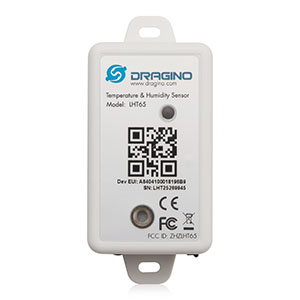
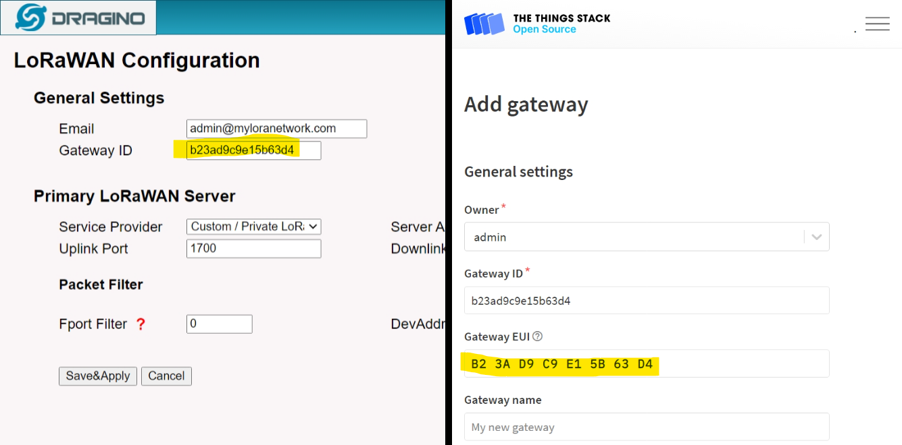
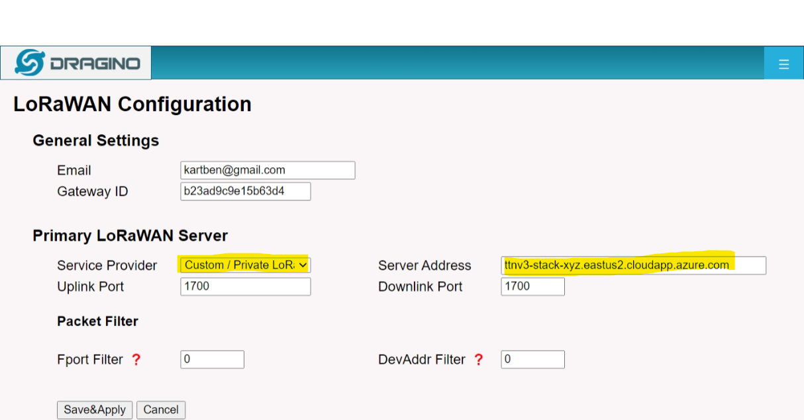
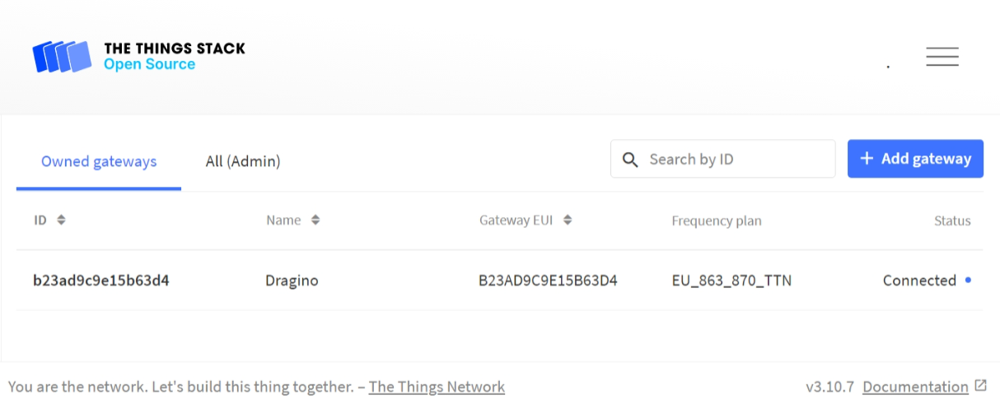
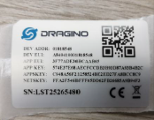
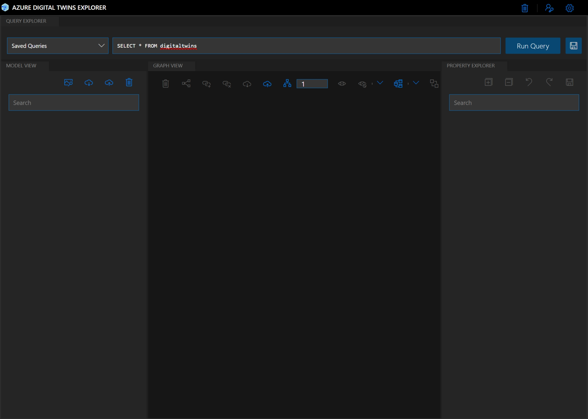
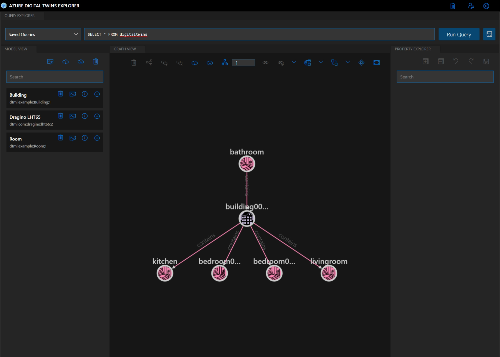
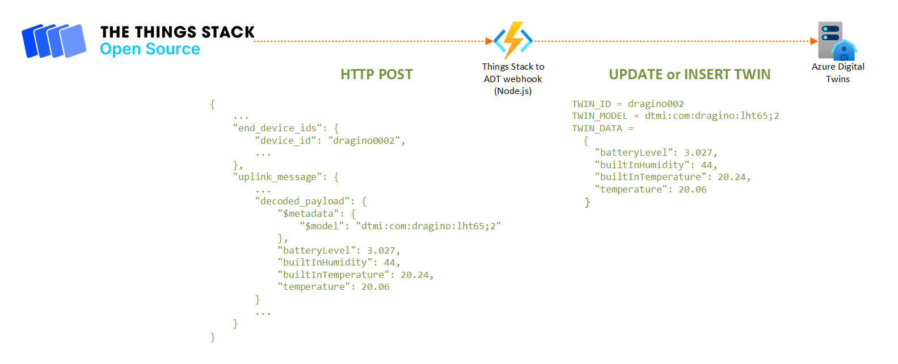
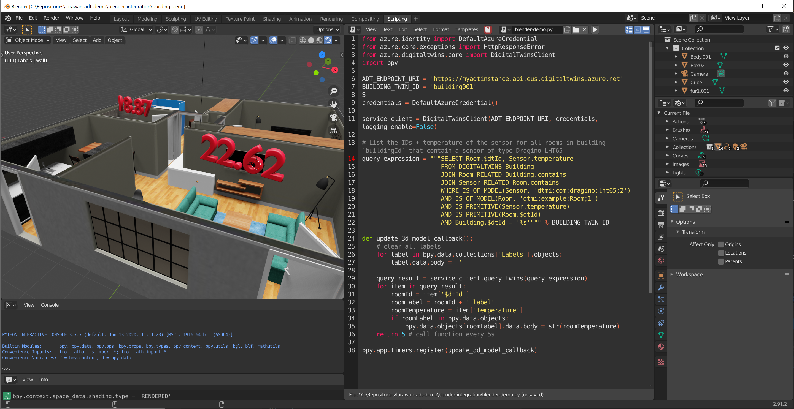

This repository contains instructions and resources for helping you setup a complete end-to-end solution showcasing integration of LoRaWAN sensors into a digital twin solution.

Note: the instructions assume you are using [The Things Stack](https://thethingsindustries.com/docs/) as your LoRaWAN Network Server, but they can easily be adapted to work for other network servers (or any other source of sensor data really).

---

- [Pre-requisites](#pre-requisites)
- [Structure of the repository](#structure-of-the-repository)
- [Steps](#steps)
  - [Setting up a LoRaWAN Network Server](#setting-up-a-lorawan-network-server)
  - [Provisioning a LoRaWAN gateway](#provisioning-a-lorawan-gateway)
  - [Provisioning a LoRaWAN application + associated sensors](#provisioning-a-lorawan-application--associated-sensors)
  - [Setting up an Azure Digital Twins environment](#setting-up-an-azure-digital-twins-environment)
  - [Bridging The Things Stack to Azure Digital Twins](#bridging-the-things-stack-to-azure-digital-twins)
  - [Real-time 3D visualization using Blender & Azure Digital Twins SDKs](#real-time-3d-visualization-using-blender--azure-digital-twins-sdks)
- [Going further](#going-further)

---

## Pre-requisites

### Software <!-- omit in toc -->
  
- **Blender 2.91** (or later)  — [Blender](https://www.blender.org/) is a free and open-source 3D modeling and rendering tool. You can [download it](https://www.blender.org/download/) from the project website.
- An **Azure Subscription** — as you will be deploying several services in the Microsoft Azure cloud, you will need an Azure subscription. You can register for a free account [here](http://azure.microsoft.com/free).
- (optionally) **Visual Studio Code** — while not mandatory, having a local install of Visual Studio Code will be useful. Alternatively, you may want to simply open this repository in **GitHub CodeSpaces**.

### Hardware <!-- omit in toc -->

- A **LoRaWAN gateway**. This tutorial has been tested with the [Dragino LPS8 Indoor LoRaWAN Gateway](http://www.dragino.com/products/lora-lorawan-gateway/item/148-lps8.html), but virtually any LoRaWAN gateway should work.
- [**Dragino LHT-65**](http://www.dragino.com/products/lora-lorawan-end-node/item/151-lht65.html) temperature sensors.

| Dragino LPS8 Indoor Gateway      | Dragino LHT-65 Temperature Sensor |
| -------------------------------- | --------------------------------- |
|  |  |

## Structure of the repository

As you may be interested in starting by directly exploring the various bits and code snippets that make up the end-to-end solution, below is a quick overview of the different resources contained in this repository:

```default
lorawan-adt-demo
├─> blender-integration         # Blender resources (scene, Python scripts, ...)
├─> models                      # DTDL model files for the various entities (twins) of our environment
├── README.md                   # This README file :)
├─> ttn-to-adt-azurefn
│   └─> ttn-webhook             # The serverless function (webhook) routing TTN uplink messages to ADT
└─> ttn_payload_formatters      # The Javascript "codecs" for converting the payloads of the LoRaWAN sensors used in the demo
```

## Steps

### Setting up a LoRaWAN Network Server

The recommended approach is to follow the instructions in [this](https://github.com/kartben/thethingsstack-on-azure) repository, and to get your own network server, based on The Things Stack, up and running on Azure.

If you want to use The Things Network v2, or any other network server really, the instructions below will still apply, granted that you adapt them in order to:

1. decode the uplink packets using whichever mechanism your LNS exposes for enabling payload formatting/decoding.

1. configure your application server so that it makes HTTP POST calls to the Azure Functions webhook that we will be setting up later whenever uplink messages are being received.

Now, for sensor data to eventually flow all the way from The Things Stack to Azure Digital Twins, we need to start at the beginning, and get them sensors connected! In the following steps, you will provision your gateway, sensors, and LoRaWAN application in The Things Stack.

### Provisioning a LoRaWAN gateway

The steps below are assuming that you've already gone through the steps needed to make sure that your Dragino LPS8 gateway (or equivalent) is already properly configured to connect to the Internet, either via Wi-Fi or an Ethernet cable.

1. Follow the [official instructions](https://www.thethingsindustries.com/docs/gateways/adding-gateways/) to register your gateway in The Things Stack.

    Set the Gateway EUI to the same ID that can be found in the "LoRaWAN Configuration" page of your Dragino gateway admin console.

    

    Pick the frequency plan corresponding to match your region and what your gateway is configured (see "LoRa Configuration" page)

    

1. Once the gateway is created in your Things Stack instance, you can go back to the LoRaWAN Configuration of the gateway, and update the "LoRaWAN Server" in order to actually connect the gateway to your very own LNS.

    - Set the **Service Provider** field to: "Custom / Private LoRaWAN".
    - Set the **Server Address** to the host name of your Things Stack server instance, ex. `ttnv3-stack-xyz.eastus2.cloudapp.azure.com`.

    

    Save & Apply the settings, and The Things Stack should shortly start showing it as "Connected"!

    

### Provisioning a LoRaWAN application + associated sensors

1. Follow the [official instructions](https://www.thethingsindustries.com/docs/integrations/adding-applications/) to register a new application for our smart building

1. Once the application is created, navigate to the "Devices" menu of your application, and once again use the [official instructions](https://www.thethingsindustries.com/docs/devices/adding-devices/) to register the temperature sensors.

    The LHT65 sensors support OTAA activation mode, and all the information needed to provision them should be provided on the sticker of the box your sensor came with.

    

1. Just like any other LoRaWAN sensor, the LHT65 sensors only have 


Note: If you do not own a Dragino LHT-65 temperature sensor, or even an actual gateway, we still have you covered. The Things Stack allow you to simulate uplink messages, effectively allowing you to pretend that an actual device is sending data.

Head over to the "Messaging" section of your end node in the Things Stack Console, and use any of the following payload examples (hex-encoded) to simulate uplink traffic:

```default
cb f2 07 f5 01 c7 01 07 bd 7f ff
```

This corresponds to a battery level of 3.058V, a humidity level of 45.5%, temperature of 20.37℃, and temperature as reported by the external sensor of 19.81℃.

```default
cb f2 07 f8 01 a1 01 07 bd 7f ff
```

This one corresponds to a battery level of 3.058V, a humidity level of 41.7%, temperature of 20.4℃, and temperature as reported by the external sensor of 19.81℃.

### Setting up an Azure Digital Twins environment

1. Follow the [install instructions](https://docs.microsoft.com/en-us/azure/digital-twins/quickstart-adt-explorer#set-up-azure-digital-twins-and-adt-explorer) from the Azure Digital Twins Documentation in order to **setup a new Azure Digital Twins instance** in your Azure subscription, and to configure the ADT Explorer tool to start interacting with it.

    Once your ADT instance and ADT Explorer are fully setup, you should be able to just open your favorite web browser at [http://localhost:3000](http://localhost:3000), and start using the Explorer. The first time you open it, it will ask you for the URL of your ADT endpoint. 

    You can then try to run the default query, which should not throw any error—and return no twin whatsoever, as our instance is fresh off the press!

    

2. Use the ADT Explorer user interface ( icon in the Model View pane) to import the three JSON files contained in the `models/` folder (`building.json`, `room.json`, `Dragino LHT65.json`) into your ADT instance.

    Optionally, you can also associate the PNG icon files found in the very same folder to each entity ( icon).

3. The next step consists in **creating the twin graph describing our smart building** environment. For each of the following entities, use the  icon to create new entities:

    - `building001`, of type Building ;
    - `bedroom001`, of type Room ;
    - `bedroom002`, of type Room ;
    - `kitchen`, of type Room ;
    - `bathroom`, of type Room ;
    - `livingroom`, of type Room.

    __Note__: We are deliberately not creating the twins for our sensors manually, as they will be automatically be inserted in the graph once we have completed the integration between the LoRaWAN Network Server and ADT, later in the tutorial. 

4. Finally, we need to **attach the various rooms to the building we've created**. Select `building001` in the graph and, while maintaining the SHIFT (⇧) key pressed, select `bedroom001` ; you can now use the  to create a `contains` relationship between the two twins.

    Repeat this step for all the other rooms, in order to add them all to `building001`. Your twin graph should now look like the following.

    

### Bridging The Things Stack to Azure Digital Twins

At this point, we have actual sensors connected to a LoRaWAN network and reporting temperature, humidity, and battery level at regular intervals. We also have a twin graph modeling, in a very simplified way, a building. 

In this step we are going to bridge the LoRaWAN application server to our Azure Digital Twins instance so that our sensors, together with the data they are reporting, appear in the twin graph.



1. TODO explain how to deploy (and configure) the Azure Function

### Real-time 3D visualization using Blender & Azure Digital Twins SDKs

Now that we have sensor data flowing into our Azure Digital Twins graph, we are going to look at how this graph can be queried from a 3rd party application, Blender in our case, in order to visualize and contextualize our digital twins.

1. From the `python\bin` folder of your Blender install, run the following (requires admin privileges) commands to install the Azure Digital Twins Python SDK and its dependencies:

    ```bash
    ./python -m pip install --upgrade pip
    ./python -m pip install azure-digitaltwins-core azure-identity
    ```

1. Launch Blender and open the [`blender-integration/building.blend`](blender-integration/building.blend) file.

1. Update the following variables in the script:

    - replace `<ADT_ENDPOINT_URI>` with the actual URI of your ADT endpoint, ex. `https://myadtinstance.api.eus2.digitaltwins.azure.net` ;
    - replace `<BUILDING_TWIN_ID>` with the id you gave to the Building twin you created earlier, ex. `building001`.

1. Use the Alt+P shortcut or press the play button in the text editor's toolbar in order to start executing the script. 

    After a few seconds—the UI might momentarily become unresponsive—, the 3D model should get updated, and any existing big 3D red temperature label should disappear. That's expected behavior: if you look closely at the Digital Twin query (line 14), it is fetching all the rooms that contain a sensor. Since there is no room (yet!) meeting the criteria, the query returns an empty result ; therefore, besides lines 26-27 clearing up the labels, nothing else happens. 

1. Use the Azure Digital Twins Explorer and re-run the default `SELECT * FROM digitaltwins` query. You should now see something—that you probably expected if you've been paying attention: there are new twins for the Dragino LHT65 sensors. 

    As the sensors have started to send uplink LoRaWAN messages, The Things Stack has picked those up, decoded them, and called the Azure Functions webhook that has created (and later updated) the digital twins corresponding to the sensors.

And that's it, you should now see your 3D model update in near real-time (that is, every 5 seconds)! Whenever your sensors send new data, the twin graph gets updated, and the query picks up the updates to the twins. If the twin of a room happens to be connected to a sensor in the graph, the temperature of this room is automatically showing up above the room's ceiling!



## Going further

If you reached this point, and if you are interested in experimenting further with the concepts of digital twins, here's a non-exhaustive lists of things you may want to consider:

- Implement a **push mechanism** in order to replace the aggressive and unnecessary polling which the Blender Python script is currently doing every 5 seconds. You could use SignalR to that effect, see the "[Integrate Azure Digital Twins with Azure SignalR Service](https://docs.microsoft.com/en-us/azure/digital-twins/how-to-integrate-azure-signalr)" section in the Azure Digital Twins documentation ;
- Extend the Blender script to not only update the 3D scene based on the digital twins' state, like we are doing at the moment, but also to **update the twins based on interactions happening with the 3D digital model** (ex. flipping a "virtual" wall switch) ;
- Add **additional data sources**. You twin graph can be populated by virtually any source, including of course [telemetry coming from devices connected to **Azure IoT Hub](https://docs.microsoft.com/en-us/azure/digital-twins/how-to-ingest-iot-hub-data). 

## Author <!-- omit in toc -->

👤 **Benjamin Cabé**

- Website: [https://blog.benjamin-cabe.com](https://blog.benjamin-cabe.com)
- Twitter: [@kartben](https://twitter.com/kartben)
- Github: [@kartben](https://github.com/kartben)
- LinkedIn: [@benjamincabe](https://linkedin.com/in/benjamincabe)

## 🤝 Contributing <!-- omit in toc -->

Contributions, issues and feature requests are welcome!

Feel free to check [issues page](https://github.com/kartben/lorawan-adt-demo/issues).

## Show your support <!-- omit in toc -->

Give a ⭐️ if this project helped you!


## 📝 License <!-- omit in toc -->

Copyright &copy; 2021 [Benjamin Cabé](https://github.com/kartben).

This project is [MIT](/LICENSE) licensed.

***
_This README was generated with ❤️ by [readme-md-generator](https://github.com/kefranabg/readme-md-generator)_